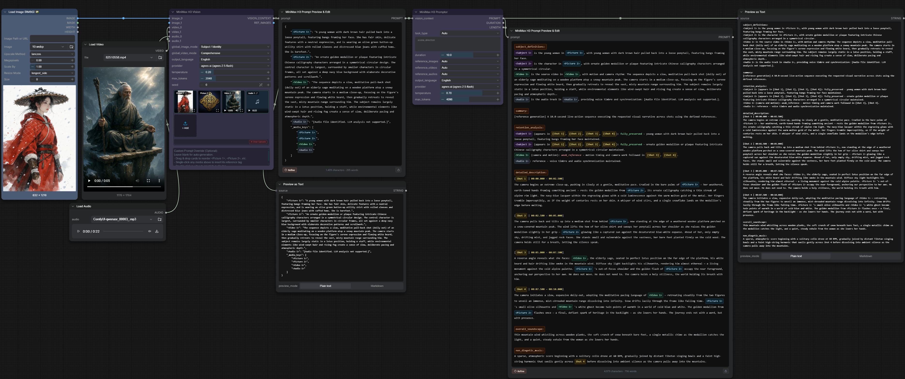

# ComfyUI-Minimax-H3-Promptor Update Log

---
## V1.2.0 (2026/08/13)
Release Notes: (Settings Hub & Core Architecture Overhaul)

### 🌟 Highlight: Native ComfyUI Settings Integration (API Hub)
- **Centralized API Management**: Completely removed the clunky `api_key` and `model_name` input fields from the Node interfaces. We built a beautiful, native-feeling ComfyUI Settings Panel (under the Gear icon -> MiniMax H3 API Settings) to manage all providers in one place globally.
- **Provider Connection Tester**: Added an inline ping-tester directly in the API Settings Panel. Instantly click "Test" to verify if your Base URL and Key are active, completely eliminating workflow mid-generation crashes due to bad auths.
- **Hot-Reload Node Dropdowns**: Disabling a provider via the toggle switch now takes *instant* effect (just refresh the browser with `F5`). There is no longer any need to explicitly reboot the Python ComfyUI server to update Node dropdowns.
- **Native Toggles**: Upgraded the settings UI to feature standard ComfyUI iOS-style visual toggle switches.
- **Streamlined Custom Node UI**: The Python nodes now only ask you to select a `Provider` from a dynamic dropdown (which syncs automatically to your panel) and retain only `temperature` and `max_tokens` for on-the-fly workflow tuning.

### Dynamic Out-of-the-box Config & Hardware Stability
- **Zero-Config Startup**: The auto-generated `config.json` now ships with 6 industry-standard APIs instantly pre-configured: `OpenAI`, `Anthropic`, `Gemini`, `Ollama`, `LlamaCPP`, and `LMStudio`. New users just drop in their Key and go!
- **Anthropic Native Routing**: Cleaned up internal semantics to identify Claude standard as `Anthropic`.
- **Ollama 500 & LLaVA Fixes**: Added critical pre-flight structural fixes for local vision models (like `llama3.2-vision`). It now intelligently folds `system` prompts into the `user` block and aggressively overrides `num_ctx` to dynamically prevent the notorious Ollama 500 VRAM Overload error.
- **Agnostic Proxy Resilience**: Added explicit proxy error HTML response leaks to the error console so users can pinpoint exactly why an external OpenAI-compatible service returned a 503/500 down state.

### Official MiniMax Syntax & Timeline Accuracy
- **I2VA Frame Anchoring**: Added strict `<Picture 1>` zero-second frame anchoring directly into the visual output, ensuring the AI strictly adheres to the exact starting frame before extrapolating motion.
- **Precise Scene Timestamps**: Upgraded the internal template structure to use strict cut times (`[Shot N] At MM:SS.mmm, ...`) instead of floating time ranges, drastically improving timeline stability across multi-shot sequences.

### Full-Reference Programmatic Injection (Phase 2)
- **Automated Summary Block**: The engine now dynamically scans generation intents and pre-loads the precise HuggingFace structure header (`summary:`) with tags like `[keyframe completion]` or `[audio reference]` based directly on the visual node's internal state.
- **Retention & Preservation Analysis**: The prompt compiler now automatically generates the `retention_analysis` metadata block marking visual assets (`<Picture X>`) as `fully_preserved` and matching audio triggers without LLM hallucination.
- **Dynamic Multimodal Budgeting**: Ref2VA and Omni-tasks are incredibly complex. The word budget bounds have been dramatically uncapped (350-500 words minimum) for tasks involving multi-tag usage to ensure high-fidelity scene orchestration.

### Advanced Audio, Speaker Syncing & L2VA
- **Audio-First Token Injection**: For the first time, when connecting audio directly to the `H3_Promptor`, the prompt compiles a dedicated `<Audio N>` referencing token in the `subject_definitions` mapping. The LLM now perfectly syncs physical actions to sound.
- **Stable Dialogue IDs `(Sx)`**: Embedded conversational logic into the prompt pipeline to enforce tight `(S1)`, `(S2)` character speaker ID mapping and clear voiceover tagging.
- **Introducing L2VA (Last Frame Inference)**: Unlocked the highly requested `Last-Frame-to-Video-Audio (L2VA)` task type. Users can now provide a single ending frame, and the `H3_Promptor` will instruct the LLM to choreograph a dynamic, forward-moving narrative that mathematically converges exactly onto the target pose at the very last second of the generation.

---
## V1.1.0 (2026/08/07)

### Infinite Dynamic Sockets (ComfyAPI v3 Autogrow)
- **Limitless scaling**: Refactored the `H3_Vision_Analyzer` to completely utilize ComfyUI's native API v3 `Autogrow` inputs. The rigid 4-image limit is gone. Users can now infinitely chain as many `<Picture>` and `<Video>` references as their ComfyUI can handle without cluttering the screen with unused ports.

### Unprecedented Fine-Grained Prompt Overrides
- **Laser-focused Control**: Added a powerful multi-line text widget (`custom_prompt_override`) to the Vision Analyzer. By typing `<Picture 2>: focus entirely on lighting` or `image_3: describe the sword only`, users can surgically override the Vision LLM instructions for specific frames, while allowing all unmentioned media to intelligently fall back to the global analysis modes.

### Invisible VRAM Unloading & Management
- **Seamless Local Hosting**: Optimizing for 16GB VRAM set-ups, the explicit VRAM UI toggle has been replaced with invisible background logic. When selecting local providers like `ollama`, the node automatically wraps execution in `model_management.unload_all_models()` and `soft_empty_cache()`, preventing the user from ever seeing OOM errors when transitioning from LLM analysis to actual H3 video generation.

### Core Prompt Architecture Upgrade & De-Patching (The "Clean Blueprint" Update)
- **Zero-Hallucination Inline Tagging**: We entirely refactored the prompt compilation process. Previously, LLMs were forbidden from using `<Picture X>` tags, leading to severe tag parsing conflicts. Now, the internal pipeline explicitly calculates available visual anchors and seamlessly forces the LLM to embed these tags *directly into the narrative action lines*, perfectly mimicking Official Minimax H3 documentation.
- **Flawless 6-Part Output Integration**: The `H3_Promptor` no longer relies on complex regex fallbacks. It uses a pristine Python string-builder sequence to accurately stack the mandatory 6-part schema (`subject_definitions`, `summary`, `retention_analysis`, `detailed_description`, `overall_soundscape`, `non_diegetic_music`) exactly as HuggingFace mandates.
- **Audio Routing Fix**: Patched a fatal loop gap where Audio-to-Video and Image-to-Audio pipelines were accidentally being ignored by the detector.
- **Sequential Multi-Modal Processing**: The Vision Analyzer now processes multiple images and videos sequentially (one at a time) rather than in a batch. This wholly prevents API request failures from downstream proxies limiting token structures, and eliminates VLM image-confusion during processing.

### "Auto" Intuitive Media Routing
- **Smart UX Dropdowns**: We abandoned the rigid `0` integer sliders for media counts. The UI now features intelligent Dropdown menus defaulting to `"Auto"`. When disconnected, it stays at 0 (perfect for Text-to-Video). The moment a Vision Analyzer is attached, "Auto" (or any manual number) is effortlessly overridden by the underlying engine for flawless multi-modal stability.

### Millisecond Timestamp Alignment
- **Automated Precision**: For multi-image setups (FL2VA) or time-sensitive inputs, the system now mathematically calculates precise cuts and first/last frame alignments based on your exact video duration.

### Dynamic Word Budget
- **Smarter Length Control**: The prompt builder now calculates an optimal word allowance depending on the target duration of your video. This actively prevents the LLM from over-describing short clips and ensures concise, highly-effective action descriptions.

### Strict Audio/Music Separation
- **Independent Sound Tracks**: All audio-related instructions are now forcefully extracted and formatted into their dedicated environment (Audio) and non-diegetic (Music) parameters, ensuring clean sound generation without mixed directives.

### Official Token Compatibility
- **Full Latent Binding Support**: Replaced legacy `Image1` style tags with the official `<Picture 1>` and `<Video 1>` tokens. This ensures flawless cross-attention injection and perfect compatibility across all ComfyUI MiniMax ecosystem nodes.

### Comprehensive Documentation
- **Official Master Tutorials**: Created `tutorials.md` and `tutorials_zh.md`, replacing heavy backend code documentation with 9 practical, production-ready Workflow Recipes (including Lip-Sync, Anime Style Transfer, Day-to-Night Morph, and more).
